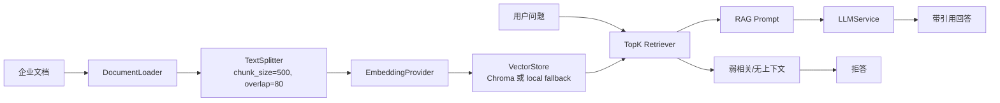
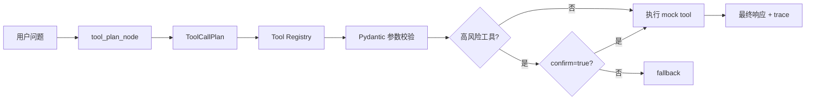

# 企业知识库与业务 Agent 平台

面向秋招展示的企业内部 RAG + Tool Calling Agent 项目。项目不是普通聊天机器人，而是围绕企业知识库问答、引用溯源、业务工具调用、参数校验、高风险确认和 TraceID 链路日志构建的后端原型。

当前版本默认可离线运行：使用 `HashEmbeddingProvider`、本地 JSON 向量索引和 mock LLM。也保留了真实 RAG 链路扩展：可通过环境变量切换到 Sentence Transformers、Chroma，以及 DeepSeek / OpenAI-Compatible Chat API。

## 技术栈

- Python、FastAPI、Pydantic
- LangGraph 状态图编排
- 可替换 Embedding：Hash fallback / Sentence Transformers
- 可替换向量库：Chroma / 本地 JSON fallback
- OpenAI-compatible LLMService：mock / deepseek / openai
- Pytest、Docker、GitHub Actions

## 当前能力

- 加载 `data/docs` 下的 `.md` / `.txt` 示例企业文档。
- 文档切片保留 `source`、`title`、`chunk_id`、`start_index`、`end_index`。
- 构建可持久化向量索引，支持 TopK 检索并返回 score。
- RAG 回答只基于检索上下文，返回引用来源。
- 检索上下文不足时返回统一拒答文案。
- 支持 mock LLM 和真实 OpenAI-compatible LLM，真实 LLM 失败时回退到抽取式回答。
- 支持 Tool Registry、Pydantic 参数校验和统一工具执行入口。
- 实现 3 个 mock 业务工具：订单退款状态查询、用户账号状态查询、后台任务触发。
- 高风险工具 `script_task_tool` 必须 `confirm=true` 才能执行。
- 使用 LangGraph 编排 RAG + Tool 流程，每个关键节点写入 trace 日志。
- 提供 FastAPI 接口：知识库索引、Agent 对话、trace 查询、健康检查。

## 系统架构

```text
app/
  main.py                  # FastAPI API 入口
  graph.py                 # LangGraph 编排
  state.py                 # AgentState
  rag/
    document_loader.py     # 文档加载
    text_splitter.py       # 文本切片
    embedding_service.py   # Embedding Provider 抽象
    vector_store.py        # Chroma / 本地向量库门面
    retriever.py           # TopK 检索
    prompt_builder.py      # Prompt 构建
  services/
    rag_service.py         # RAG 主流程
    llm_service.py         # mock / OpenAI-compatible LLM
    agent_service.py       # Agent 对外服务
    log_service.py         # Trace 日志
  tools/
    tool_registry.py       # 工具注册中心
    tool_plan.py           # 工具计划、校验、执行
    sql_query_tool.py
    http_api_tool.py
    script_task_tool.py
  schemas/
    request.py
    response.py
  prompts/
    rag_answer_prompt.txt
    rag_llm_answer_prompt.txt
data/
  docs/                    # 示例企业文档
  mock/                    # mock 业务数据
tests/                     # 单元测试和接口测试
vector_store/              # 持久化索引
logs/                      # TraceID 日志
```

## RAG 流程



文档需要切片，是因为企业文档通常很长，整篇向量化会稀释局部语义，也会让上下文过长。chunk 太大会召回噪声，chunk 太小会丢失步骤之间的上下文；overlap 用来降低答案被切在边界处的概率。

## Tool Calling 流程



工具注册中心位于 `app/tools/tool_registry.py`。每个工具包含 `name`、`description`、`args_schema`、`handler`、`risk_level`。LLM 或规则生成的工具计划不能直接执行 handler，必须先经过 registry 校验和 Pydantic 参数校验。

## 快速启动

安装依赖：

```bash
py -m pip install -r requirements.txt
```

构建知识库索引：

```bash
py -X utf8 run_demo.py --build-index
```

命令行演示：

```bash
py -X utf8 run_demo.py --question "订单退款流程是什么？"
py -X utf8 run_demo.py --question "查询订单 10001 的退款状态。"
py -X utf8 run_demo.py --question "查询用户 U1001 的账号状态。"
py -X utf8 run_demo.py --question "触发订单退款状态同步任务。" --confirm
```

启动 API 服务：

```bash
py -m uvicorn app.main:app --reload
```

健康检查：

```bash
curl http://127.0.0.1:8000/health
```

## 环境变量

复制 `.env.example` 后按需配置。默认配置无需 API Key，可离线跑通测试和演示。

```text
EMBEDDING_PROVIDER=hash
EMBEDDING_MODEL=BAAI/bge-small-zh-v1.5

VECTOR_STORE_TYPE=chroma
CHROMA_COLLECTION_NAME=enterprise_rag_docs

LLM_PROVIDER=mock
LLM_API_KEY=
LLM_BASE_URL=
LLM_MODEL=deepseek-chat
LLM_TIMEOUT_SECONDS=30
```

推荐演示模式：

- 离线稳定演示：`EMBEDDING_PROVIDER=hash`，`LLM_PROVIDER=mock`。
- 真实 Embedding 演示：`EMBEDDING_PROVIDER=sentence_transformer`，默认模型 `BAAI/bge-small-zh-v1.5`。
- 真实向量库演示：`VECTOR_STORE_TYPE=chroma`。如果 `chromadb` 不可用，系统会自动回退到本地 JSON 索引。
- 真实 LLM 演示：`LLM_PROVIDER=deepseek` 或 `openai`，配置 `LLM_API_KEY`、`LLM_BASE_URL`、`LLM_MODEL`。

## API 示例

构建索引：

```bash
curl -X POST http://127.0.0.1:8000/knowledge/index ^
  -H "Content-Type: application/json" ^
  -d "{\"docs_dir\":\"data/docs\"}"
```

响应：

```json
{
  "status": "success",
  "indexed_chunks": 6
}
```

Agent 对话：

```bash
curl -X POST http://127.0.0.1:8000/agent/chat ^
  -H "Content-Type: application/json" ^
  -d "{\"question\":\"根据知识库说明，查询订单 10001 的退款状态，并告诉我下一步应该怎么处理。\",\"top_k\":5}"
```

响应会包含 RAG 元数据和工具调用结果：

```json
{
  "trace_id": "e4f1...",
  "status": "success",
  "answer": "1. ...",
  "citations": [
    {
      "source": "order_refund_guide.md",
      "title": "订单退款流程",
      "chunk_id": "order_refund_guide_001",
      "score": 0.46
    }
  ],
  "used_llm": true,
  "embedding_provider": "hash",
  "vector_store_type": "local_fallback",
  "need_tool": true,
  "tool_name": "sql_query_tool",
  "tool_args": {
    "order_id": "10001"
  },
  "tool_result": {
    "order_id": "10001",
    "refund_status": "processing",
    "updated_at": "2026-06-01 10:20:00",
    "payment_channel": "mock_pay"
  },
  "error": null
}
```

Trace 查询：

```bash
curl http://127.0.0.1:8000/trace/{trace_id}
```

## 示例文档

`data/docs` 内置模拟企业资料，不包含真实公司敏感信息：

- `order_refund_guide.md`：订单退款流程、退款失败处理、可用业务工具。
- `api_manual.md`：用户账号状态查询接口说明。
- `error_code_manual.md`：常见错误码与排查建议。
- `operation_faq.md`：后台任务、账号冻结、业务系统操作 FAQ。

## 示例问题

- 订单退款流程是什么？
- 退款失败应该怎么处理？
- 错误码 E1001 是什么意思？
- 用户账号被冻结时应该如何排查？
- 后台任务触发失败怎么办？
- 查询订单 10001 的退款状态。
- 查询用户 U1001 的账号状态。
- 触发订单退款状态同步任务。
- 根据错误码 E1001 的说明，查询用户 U1001 的账号状态。

## 测试

```bash
py -X utf8 -m pytest -q
```

当前测试覆盖：

- 文档加载、文本切片、向量检索。
- mock LLM、LLM 失败回退、无上下文拒答。
- 引用来源返回和 API 元数据字段。
- Tool Registry、Tool 参数校验、高风险 confirm 校验。
- LangGraph 编排、fallback、完整 RAG + Tool 流程。
- FastAPI `/knowledge/index`、`/agent/chat`、`/trace/{trace_id}`、`/health`。

## Docker

```bash
docker compose up --build
```

容器会挂载：

- `./logs:/app/logs`
- `./vector_store:/app/vector_store`

## 项目亮点

- RAG 链路可讲清楚：加载、切片、Embedding、TopK、Prompt、回答、引用来源。
- Embedding Provider 抽象清晰：离线 hash fallback 与真实 Sentence Transformers 可切换。
- 向量库门面清晰：优先 Chroma，环境不可用时自动降级本地持久化索引。
- LLMService 可插拔：默认 mock 保证测试稳定，生产演示可接 DeepSeek / OpenAI-compatible API。
- 拒答机制明确：弱相关或无上下文时不编造答案。
- Tool Calling 不是直接执行：先结构化计划，再 registry 校验，再 Pydantic 参数校验。
- 高风险工具有确认机制，适合面试追问安全边界。
- TraceID 日志贯穿节点，便于讲链路追踪和问题定位。

## 本轮没有做的内容

- 没有引入复杂前端。
- 没有接入真实公司文档或真实业务数据。
- 没有实现 Redis、权限、多租户、审计审批等企业生产能力。
- 没有让 LLM 直接执行工具。
- 没有把 API Key 写入代码。

## 下一阶段计划

1. 增加内存缓存接口并预留 Redis 实现，缓存 RAG 检索和普通工具结果。
2. 增加简单 IP 限流服务，超过阈值返回 429。
3. 将工具计划从规则增强为 LLM 结构化输出，同时保留严格校验。
4. 补充更多真实面试可讲的 trace 字段和错误码。
5. 为 README 增加一组完整端到端演示截图或录屏脚本。
